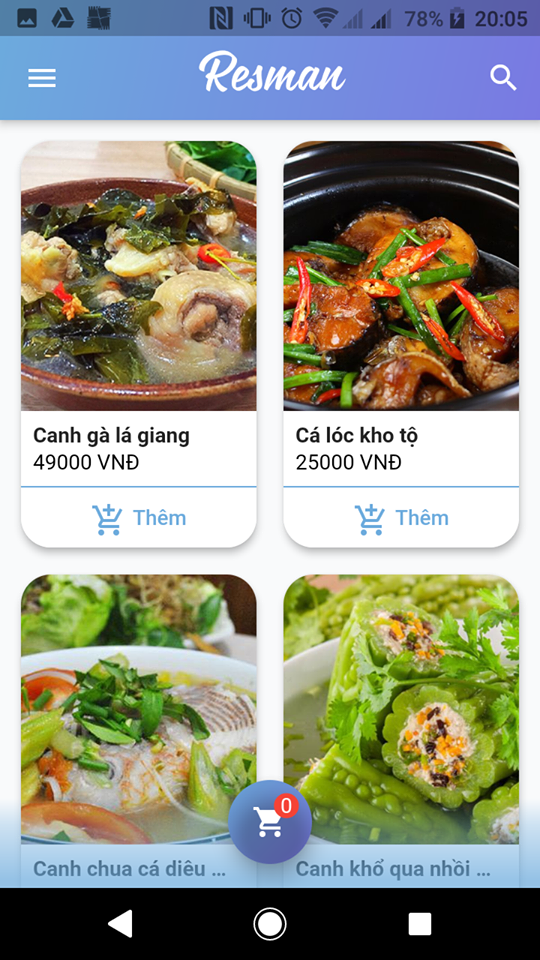

# Resman Mobile Customer

Cross Platform Mobile application for **Customer** of Restaurant Management project

# Screen shot

         

# Usage

### Clone

`git clone git@github.com:restaurant-management/resman-mobile-customer.git`

`cd resman-mobile-customer`

### Get package

`flutter pub get`

### Add your **google-sevices.json** to **android/app/**

### Apply launcher icon

`flutter pub run flutter_launcher_icons:main`

### Run

`flutter run`

# Contributors
Thanks for all contributors ([emoji key](https://allcontributors.org/docs/en/emoji-key)): 

<!-- Contributors table START -->
| [ Hieren Lee](https://github.com/hienlh) | [ Nguyennt98](https://github.com/Nguyennt98) 
| :---: | :---: | 
[📖](https://github.com/restaurant-management/resman-mobile-customer/blob/master/README.md "Document") [🚇](# "Infrastructure (Hosting, CI-CD, etc)") [💻](https://github.com/restaurant-management/resman-mobile-customer/commits?author=hienlh "Code") [🎨](# "Design") [🚧](# "Maintenance") [👀](https://github.com/restaurant-management/resman-mobile-customer/pulls?q=is%3Apr+reviewed-by%3Ahienlh "Reviewed Pull Requests") | [💻](https://github.com/restaurant-management/resman-mobile-customer/commits?author=Nguyennt98 "Code") [🎨](# "Design") [🐛](https://github.com/restaurant-management/resman-mobile-customer/issues/created_by/Nguyennt98 "Bug Report") [⚠️](# "Tests") |
<!-- Contributors table END -->

This project follows the [all-contributors](https://allcontributors.org) specification.
Contributions of any kind are welcome!

# License

